# Anthropic Managed Agents — Screenshots

Screenshots captured from a YouTube video demo of **Claude Managed Agents**, available on the [Claude Platform](https://www.anthropic.com/).

Managed Agents let you define an agent (system prompt, model, tools, MCPs, skills) and run it as a hosted session via the API (`POST /v1/agents`, `anthropic-beta: managed-agents-2026-04-01`) or through the visual agent builder. Sessions are observable end-to-end with a transcript/debug timeline.

## Screenshots

| # | Screenshot |
|---|------------|
| 01 | 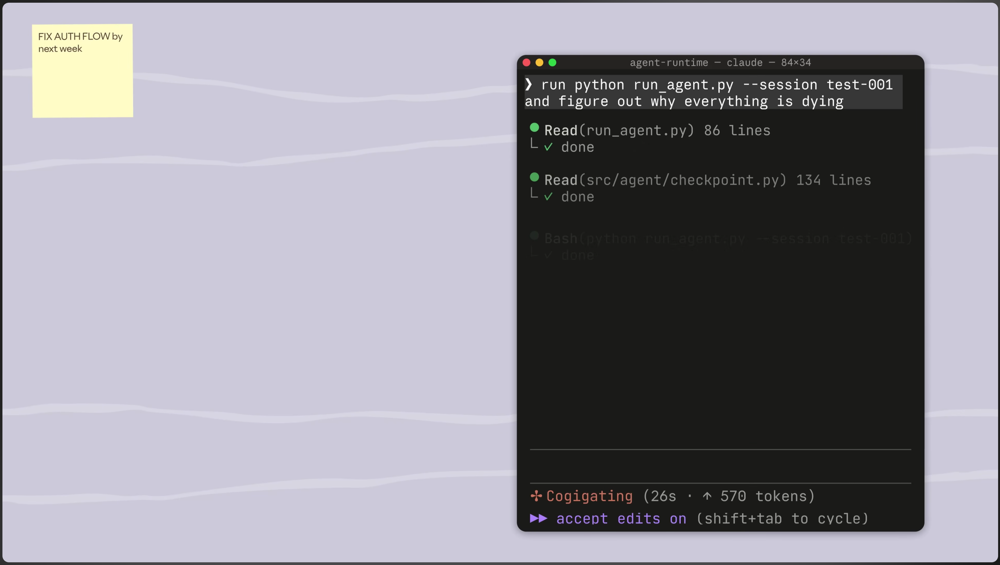 |
| 02 | 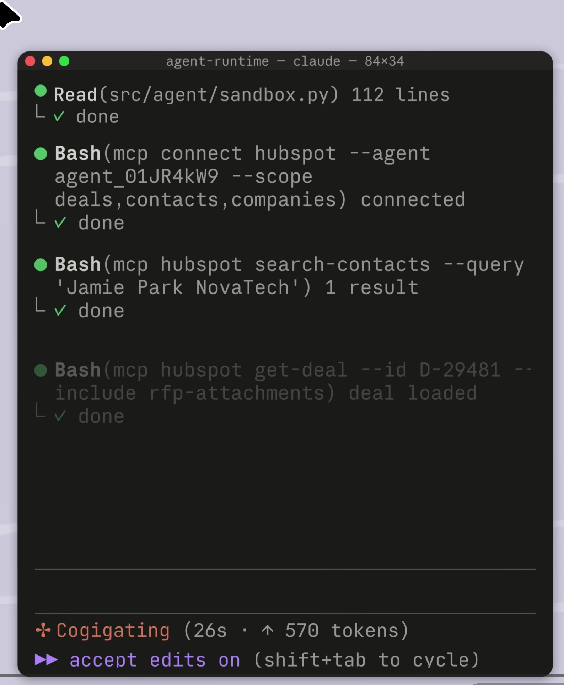 |
| 03 | 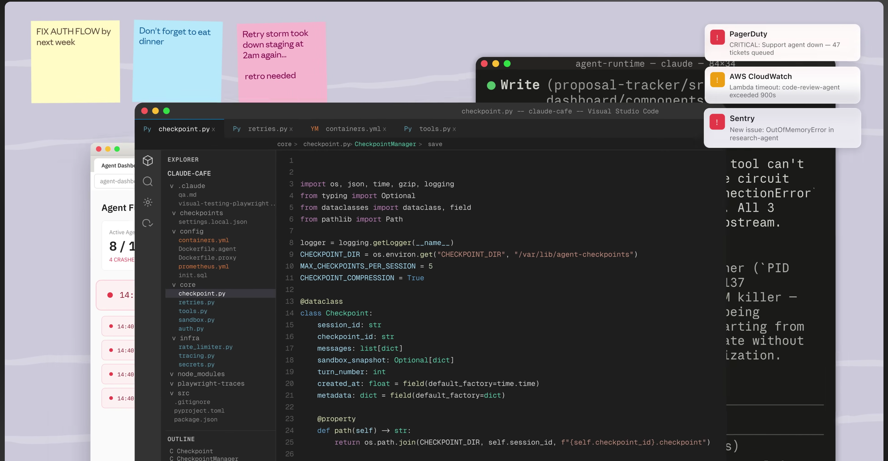 |
| 04 | 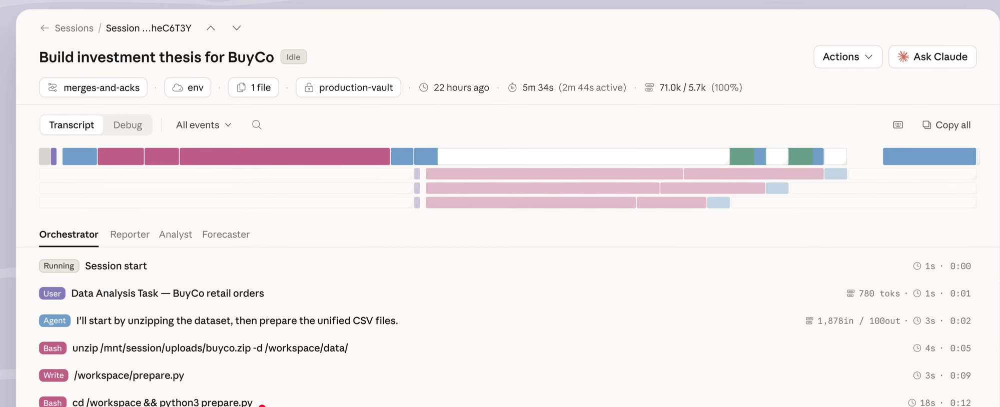 |
| 05 | 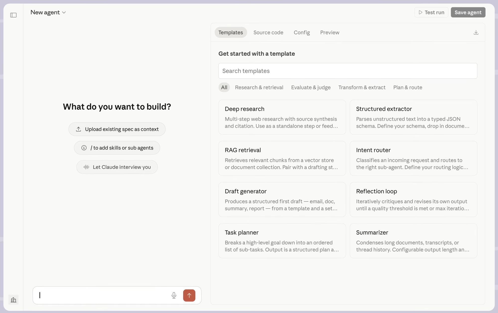 |
| 06 | 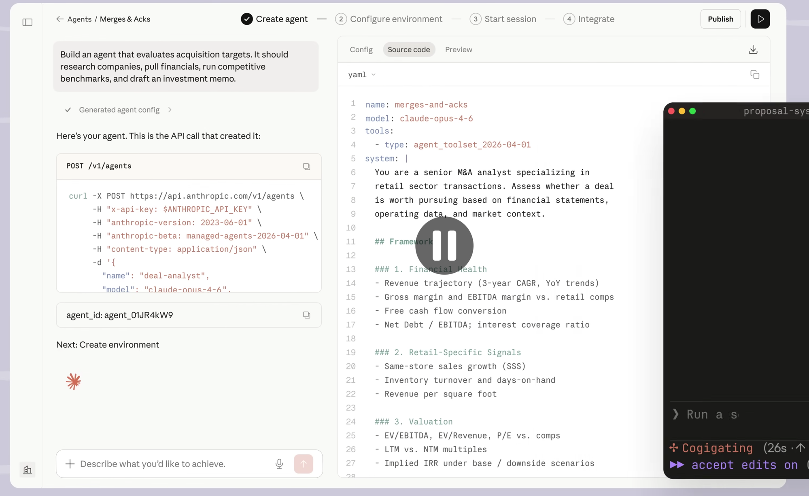 |
| 07 | 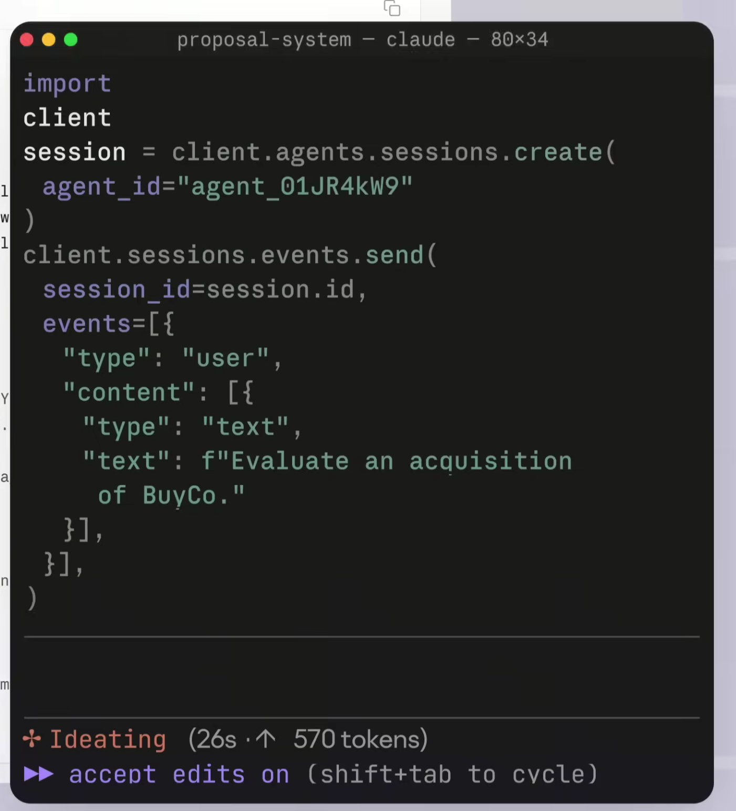 |
| 08 | 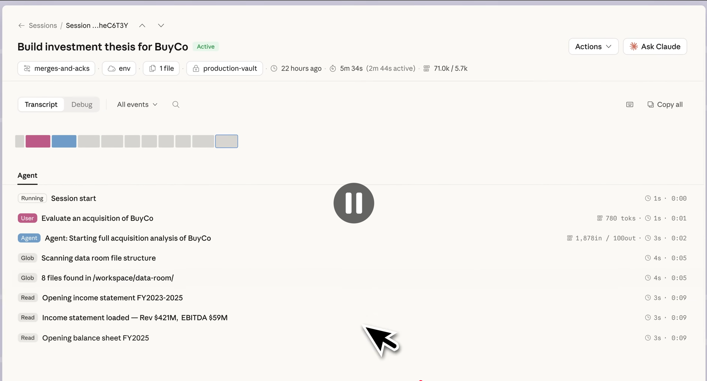 |
| 09 | 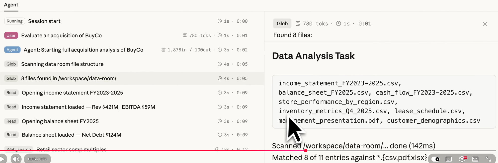 |
| 10 | 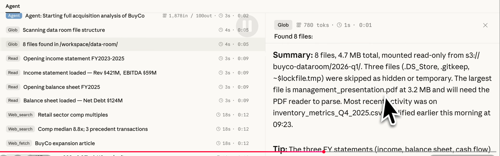 |
| 11 | 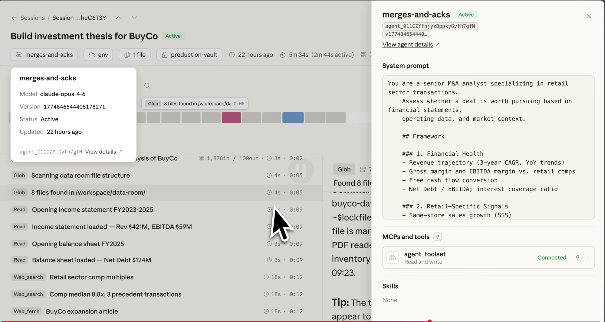 |
| 12 | 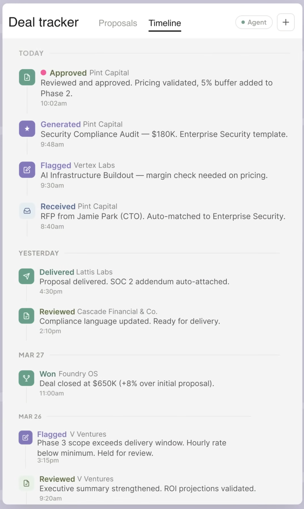 |
